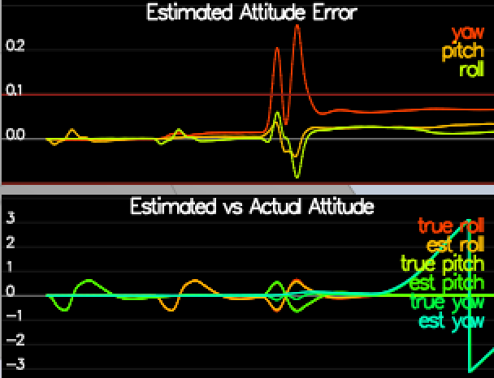
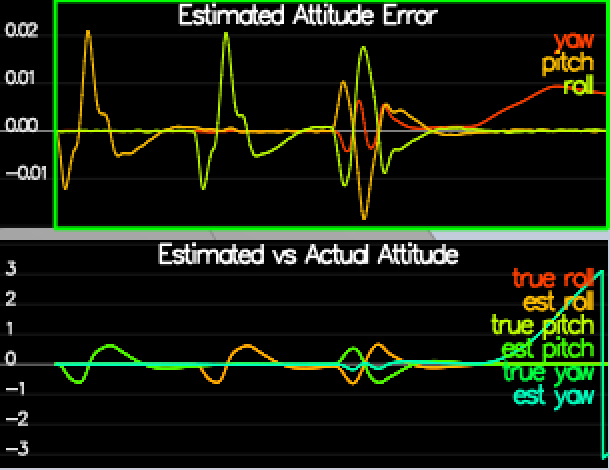

#FCND-Estimation Writeup
Brian Hilnbrand

##Step 1
To calculate the standard deviation of the GPS and IMU, I performed the following method. I logged a full 10s loop of the data into a text file. Next, I removed the top header line in the log, so only time and value were left in a csv file. I then used Numpy in Python to import the txt file as a numpy array. Next, I used the numpy standard deviation tool to calculate the standard deviation of the values in the file.
```
$ fname = os.path.join("Graph2.txt")
$ imu_x = np.loadtxt(fname, delimiter=",")
$ np.std(imu_x[:,1])
0.51095120101124747
```


##Step 2
To best predict attitude (roll, pitch, yaw), I implemented a non-linear complimentary filter. This involved using quaternions to convert angular rates from IMU to body frame, multiply by the euler angles quaternion, then convert back to IMU frame. Using quaternions made this process very easy to implement. Finally, I normalized yaw to -pi to pi.

Small-angle approximation integration             |  Non-linear complimentary filter
:-------------------------:|:-------------------------:
  |  
