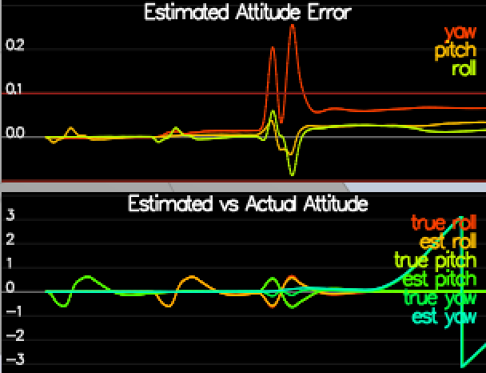
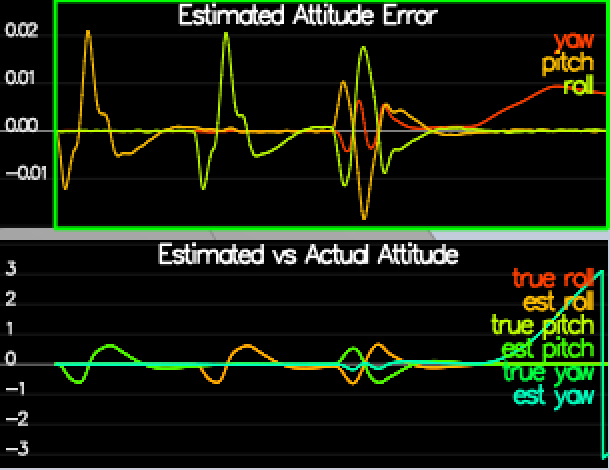
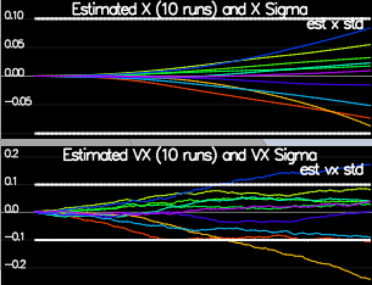
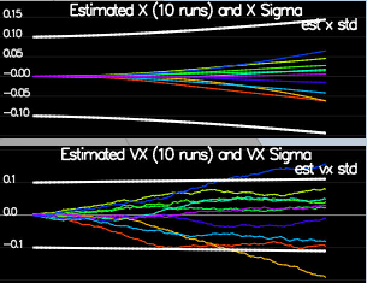
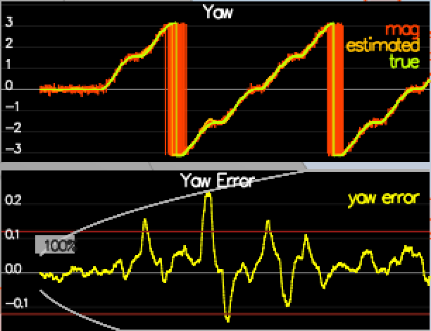
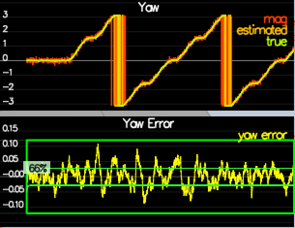
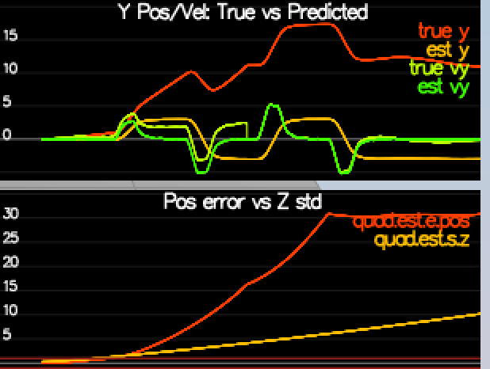
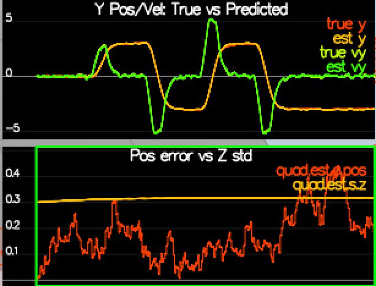

# FCND-Estimation Writeup #
Brian Hilnbrand

## Step 1 ##
To calculate the standard deviation of the GPS and IMU, I performed the following method. I logged a full 10s loop of the data into a text file. Next, I removed the top header line in the log, so only time and value were left in a csv file. I then used Numpy in Python to import the txt file as a numpy array. Next, I used the numpy standard deviation tool to calculate the standard deviation of the values in the file.
```
$ fname = os.path.join("Graph2.txt")
$ imu_x = np.loadtxt(fname, delimiter=",")
$ np.std(imu_x[:,1])
0.51095120101124747
```


## Step 2 ##
To best predict attitude (roll, pitch, yaw), I implemented a non-linear complimentary filter. This involved using quaternions to convert angular rates from IMU to body frame, multiply by the euler angles quaternion, then convert back to IMU frame. Using quaternions made this process very easy to implement. Finally, I normalized yaw to $-\pi$ to $\pi$.

Small-angle approximation integration             |  Non-linear complimentary filter
:-------------------------:|:-------------------------:
  |  

## Step 3 ##
To predict the new EKF covariance and state, first I calculate the new state. To do this, I use a simplistic integration method, where I add the derivative of the value * DeltaT to the original value:

$x_t = x_{t-1} + \dot xdt$

Then, I create the $R'_{bg}$ matrix, which is the partial derivative of the rotation matrix $R_{bg}$, following the following documentation:


Next is the covariance calculation step, in which I create the jacobian $g'$ matrix and then calculate the covariance matrix, both using the documentation below:


Here are the results of the predict step:

Original QPosXYStd, QVelXYStd             |  New QPosXYStd, QVelXYStd
:-------------------------:|:-------------------------:
  |  

## Step 4 ##
To update the yaw state from the magnetometer, first we set the yaw in `zFromX`, then normalize it to be between $-\pi$ and $\pi$. Finally, I set $h'$ = [0 0 0 0 0 0 0 1], the derivative of $h$.

Original Yaw error             |  New Yaw error
:-------------------------:|:-------------------------:
  |  

## Step 5 ##
To update the GPS state from the GPS, first I update the measurement model, $h$, as seen below:


Then I set $h'$ to the derivative of $h$, as seen below:


Here are the results:

Original GPS error             |  New GPS error
:-------------------------:|:-------------------------:
  |  

## Step 6 ##
This step gave me some trouble. While my quad control worked for the last project, I seemed to have a bug that was not caught last time, and this was giving me trouble for this project. On the third leg of the flight, as soon as the quad would cross the halfway point, the quad would lose control and crash. What this told me is that my code seems to have a negative number bug somewhere, or not normalized to $-\pi$ to $\pi$. This is because it's the same point in the flight that the quad loses control after flying successfully, and pretty smoothly to that point. After spending a while trying to debug, I figured that this is a "legacy" bug, and decided to use a working controller from another project online ([here is the source](https://github.com/darienmt/FCND-Term1-P4-3D-Estimation/blob/master/config/QuadControlParams.txt)). After borrowing this source, the quad flew through the whole flight and successfully passed the criteria, showing that my state estimation is working well. Here is an image of the resulting flight:


